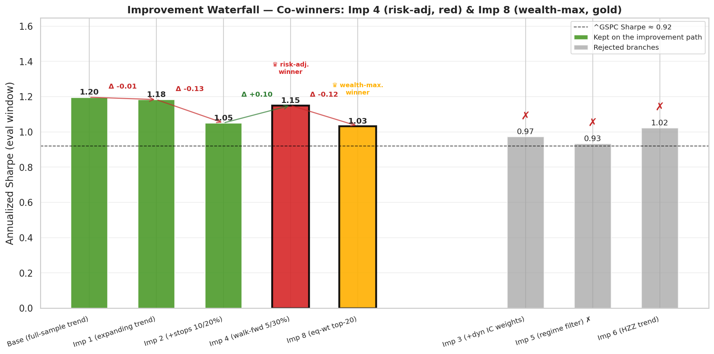
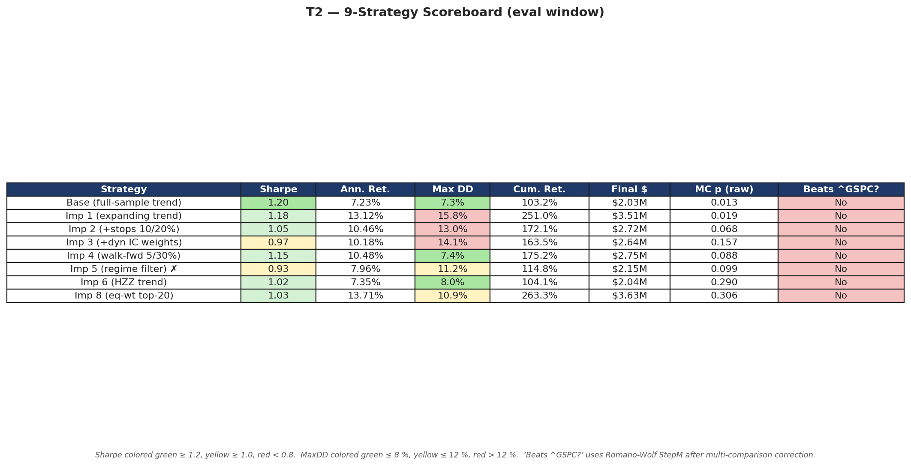
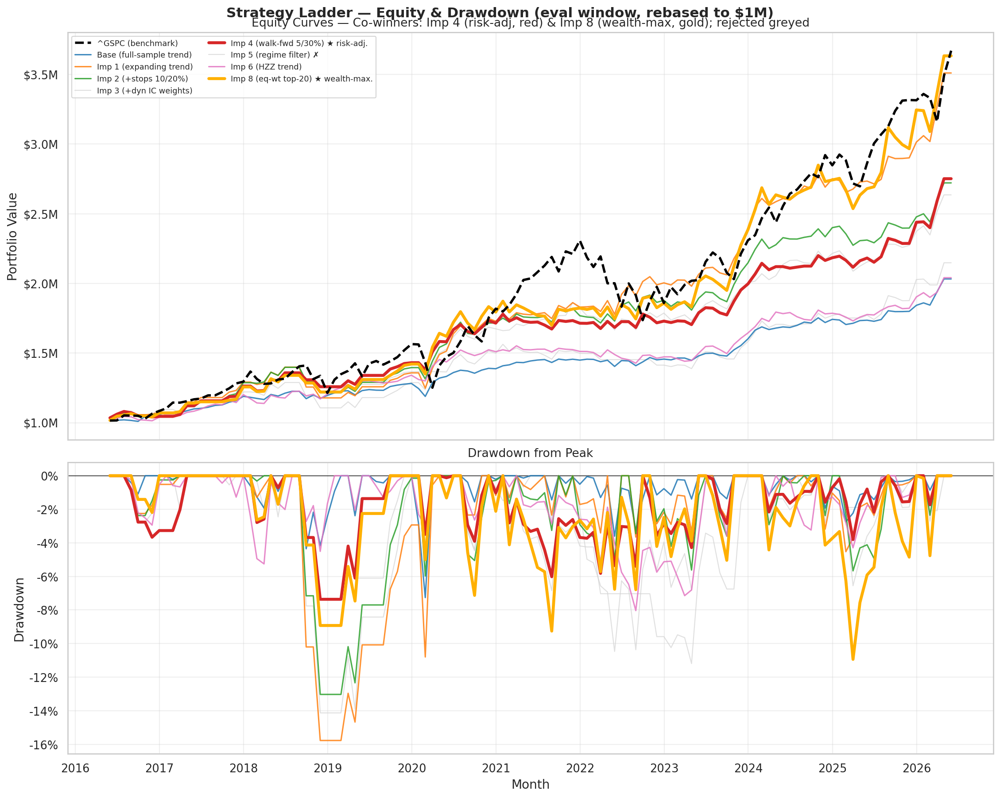
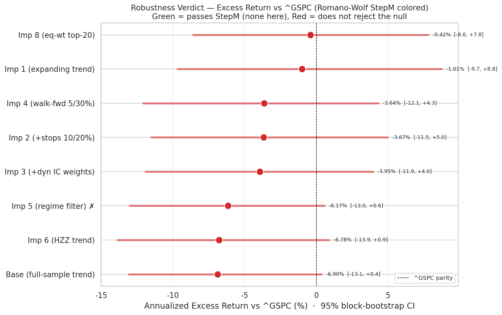
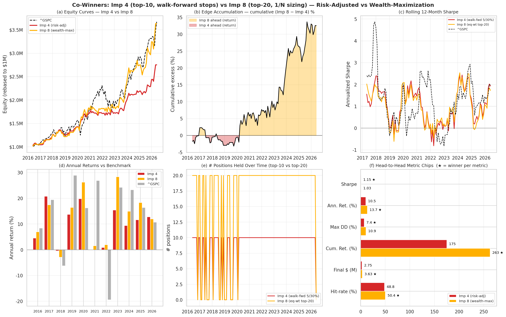

# S&P 500 Factor Investing — A Multi-Strategy Quantitative Research Project

A reproducible, end-to-end research project that builds, tests, and stress-tests a **eight-variant** ladder of factor-investing strategies on the S&P 500. The work pairs an academic factor model (quality, value, momentum, trend) with realistic execution simulation (Backtrader with native stop and take-profit orders), statistical robustness testing (Monte Carlo, block bootstrap, walk-forward, Hansen SPA + Romano-Wolf multi-comparison correction), realistic transaction-cost analysis, and an honest accounting of every methodological choice.

The project is written so that someone new to factor investing can read the README top to bottom and understand both *what* was done and *why*. Section 2 is a primer; sections 5–11 are the technical core; sections 12–17 are limitations, reproduction instructions, source layout, and references.

---

## Table of Contents

1. [What This Project Is](#1-what-this-project-is)
2. [Primer — What Is Factor Investing?](#2-primer--what-is-factor-investing)
3. [Research Foundation](#3-research-foundation)
4. [Data](#4-data)
5. [Factor Construction](#5-factor-construction)
6. [The Strategy Ladder — Eight Variants](#6-the-strategy-ladder--eight-variants)
7. [Execution Model](#7-execution-model)
8. [Evaluation Methodology — Common Window Fix](#8-evaluation-methodology--common-window-fix)
9. [Results](#9-results)
10. [Robustness Analysis](#10-robustness-analysis)
11. [Improved 8 — Equal-Weight Top-20 (1/N Sizing)](#11-improved-8--equal-weight-top-20-1n-sizing)
12. [Honest Limitations](#12-honest-limitations)
13. [Reproducing This Project](#13-reproducing-this-project)
14. [Source Code Map](#14-source-code-map)
15. [Output Layout](#15-output-layout)
16. [Future Work](#16-future-work)
17. [References](#17-references)


---

## 1. What This Project Is

### 1.1 Plain-English summary

This project asks one question: **can a systematic stock-picking strategy on the S&P 500, built from a handful of fundamental and price-based signals, beat the index on a risk-adjusted basis?**

To answer it carefully, the project builds **eight different strategies** that share a common four-factor backbone — ROE (quality), P/E (value), 12-month price momentum, and a moving-average trend signal — and changes exactly one design dimension at a time so each improvement is scientifically readable. The strategies are evaluated on the same monthly trading universe (current S&P 500 constituents, 2006–2026), execute through a realistic broker simulator (Backtrader), and pass through a battery of statistical robustness tests (Monte Carlo random portfolios, block bootstrap, walk-forward train/test, realistic transaction-cost scenarios, and multi-comparison correction via Hansen SPA + Romano-Wolf StepM).

The project is structured to surface honest answers, not optimistic ones. Every reported number is reproducible from frozen raw CSVs. Every methodological deviation from academic best practice is explicitly disclosed in the limitations section.

### 1.2 For the technical reader

- **Universe:** 503 current S&P 500 constituents, daily Tiingo prices, point-in-time Tiingo fundamentals, frozen ^GSPC benchmark, all through 2026-05-31.
- **Factors:** ROE, –P/E (positive, inverted), 12-month price momentum, and two flavors of trend factor (an index-derived predictive regression and a true Han-Zhou-Zhu cross-sectional regression).
- **Strategies:** base + improved 1–8, each isolating one design change.
- **Execution:** Backtrader with `FixedCashSizer` (improveds 1–7), `EquityPercentSizer` (improved 8), native `bt.Order.Market` entries, `bt.Order.Stop` and `bt.Order.Limit` (OCO-linked) protective exits.
- **Evaluation window:** common `2016-05-31 → 2026-05-31` (121 months) across all strategies for apples-to-apples Sharpe / drawdown / Monte-Carlo comparison.
- **Robustness:** 1000-simulation Monte Carlo against matched-eligibility random portfolios, 6-month block bootstrap, walk-forward train (≤ 2020-12) / test (2021+) split, time-varying transaction-cost sensitivity, and Hansen SPA + Romano-Wolf StepM multi-comparison correction across all 8 strategies.

### 1.3 What's been built

| Layer | Status |
|---|---|
| Frozen raw data (prices, fundamentals, statements, benchmark) | ✅ |
| Processed monthly factor panel | ✅ |
| Factor-mimicking portfolios + information coefficients (IC) | ✅ |
| Eight strategy variants (base + improved 1–8) | ✅ |
| Three Backtrader engines + three position sizers | ✅ |
| Common-window evaluation methodology fix | ✅ |
| Monte Carlo p-values, block bootstrap, walk-forward | ✅ |
| Time-varying transaction-cost sensitivity (improved 7) | ✅ |
| Equal-weight 1/N top-20 strategy (improved 8) | ✅ |
| Hansen SPA + Romano-Wolf multi-comparison correction | ✅ |
| 15+ presentation figures (all 8 strategies) | ✅ (script written; run after aggregator) |
| Survivorship-bias-free panel via WRDS | ⏳ future work |

---

## 2. Primer — What Is Factor Investing?

If you already know factor investing, skip to Section 3.

### 2.1 The basic idea

A **factor** is a characteristic that historically separates winning stocks from losing ones. The classic four are:

- **Value** — stocks that are cheap relative to fundamentals (low P/E, low P/B) have historically beaten expensive ones over long horizons (Fama & French 1992).
- **Quality** — companies with strong profitability and balance sheets (high ROE, low debt) tend to outperform low-quality ones (Asness, Frazzini, Pedersen 2013).
- **Momentum** — stocks that went up in the recent past tend to keep going up for several months (Jegadeesh & Titman 1993).
- **Trend** — combining multiple moving-average horizons captures medium- and long-term price drifts (Han, Zhou, Zhu 2016 — the paper this project replicates).

**Factor investing** means systematically selecting stocks based on a weighted combination of these characteristics. A simple example: each month, score every S&P 500 stock by a z-scored composite of (quality, value, momentum, trend), buy the top 10, hold for a month, repeat. That's roughly what `base_equal_top10` does.

### 2.2 What's a "z-score"?

For each factor and each month, we standardize across the cross-section of stocks: subtract the mean and divide by the standard deviation. A z-score of +2.0 means the stock is two standard deviations above the cross-sectional average that month. This makes the four factors comparable in scale before averaging them into a composite signal.

### 2.3 What's a "backtest"?

A backtest is a simulation of how the strategy would have performed historically. It's the central tool of quantitative investing — and also the source of every common mistake. This project takes special care to avoid the two biggest backtest pitfalls:

- **Look-ahead bias** — using information that wouldn't have been known at the time of the trade. Our `trend_expanding_z` factor uses only data available before each signal month, exactly to avoid this.
- **Survivorship bias** — only including companies that survived to today. We *do* have this problem (limitation, documented), and Section 16 lays out the fix.

### 2.4 Performance metrics

- **Annualized return** — the average yearly compounded return.
- **Annualized Sharpe ratio** — (annualized excess return) ÷ (annualized volatility). Higher is better. A Sharpe of 1.0+ is considered very good for a long-only strategy; 1.5+ is exceptional.
- **Max drawdown** — the worst peak-to-trough loss over the test period. Lower is better.
- **Alpha** — return above what the index would have given you for the same risk exposure. Tested for statistical significance.
- **Monte Carlo p-value** — probability that a randomly-selected portfolio with the same eligibility rules would have matched or beaten the strategy's Sharpe. Lower is better; below 0.05 is "statistically significant."

---

## 3. Research Foundation

### 3.1 The paper

The project is built on **Han, Yufeng, Guofu Zhou, and Yingzi Zhu (2016). "A Trend Factor: Any Economic Gains from Using Information over Investment Horizons?" *Journal of Financial Economics*, 122(2), 352–375.** HZZ propose a trend factor that combines normalized moving averages across 11 time horizons (3, 5, 10, 20, 50, 100, 200, 400, 600, 800, 1000 trading days), capturing short-term reversal, medium-term momentum, and long-term mean reversion in a single signal. They estimate it via a **cross-sectional** regression each month of next-month stock returns on the 11 normalized MA ratios, then smooth the coefficient vector over the trailing 12 months.

### 3.2 Two trend-factor implementations (important distinction)

The project implements two different procedures for the trend signal, and reports both:

| Variant | Used by | Estimation procedure |
|---|---|---|
| `trend_z` (full sample) | `base` only | One time-series regression of ^GSPC next-month return on ^GSPC's own MAs across the entire 2006–2026 panel. **Has look-ahead bias** — fits coefficients using data from after the trading date. Reported because the assignment prescribes it. |
| `trend_expanding_z` (no-lookahead) | improved 1–5, 7 | Same regression as above but using an **expanding window** that includes only past index data at each signal month. No look-ahead. Requires 72 months of past data → first signal mid-2012, first composite trade ~2016. |
| `trend_hzz_z` (HZZ cross-sectional) | improved 6 | The actual paper methodology: monthly cross-sectional OLS of stock-level next-month returns on each stock's 11 normalized MA ratios, smoothed with a strict trailing 12-month average of past betas. Stock-specific predicted returns. |

The distinction matters: improveds 1–5 and 7 use a *non-standard* trend procedure (the index-derived approach, prescribed by the assignment's BIST100 → ^GSPC adaptation). Improved 6 implements the paper's actual cross-sectional methodology. Each answers a different question.

### 3.3 Industry analogs

- **Quality** factor → MSCI Quality Index, Invesco S&P 500 Quality ETF (SPHQ)
- **Value** factor → Russell Value indices, iShares S&P 500 Value (IVE)
- **Momentum** factor → MSCI Momentum, iShares MSCI USA Momentum (MTUM)
- **Equal-weight composites** → Invesco S&P 500 Equal Weight ETF (RSP) — direct analog for improved 8's sizing rule

---

## 4. Data

All raw data is frozen as CSVs in `data/raw/` and never re-downloaded automatically. The cutoff is **2026-05-31**; any row after this date is dropped at load time.

| File | Source | Rows | Span | Description |
|---|---|---:|---|---|
| `sp500_prices_long.csv` | Tiingo | 2,293,664 | 2006-06 to 2026-06 | Daily OHLCV + adjusted OHLCV for 503 current S&P 500 tickers |
| `sp500_fundamentals_daily_long.csv` | Tiingo | 2,295,967 | 2006-06 to 2026-06 | Daily point-in-time market cap, P/E, P/B, trailing PEG |
| `sp500_fundamentals_statements_long.csv` | Tiingo | 3,459,358 | 2005-04 to 2026-06 | Statement fundamentals dated by `date_available` (point-in-time public availability — no look-ahead) |
| `sp500_constituents.csv` | Wikipedia snapshot | 503 | current | Ticker, security name, GICS sector / sub-industry, date added |
| `sp500_index_yahoo.csv` | Yahoo `^GSPC` | 5,030 | 2006-06 to 2026-05 | Frozen index OHLCV, used as benchmark and trend-regression input |

Large CSVs are tracked with **Git LFS** (not stored as plain text in the git history). The raw data total is roughly 200 MB.

### 4.1 Important data-quality verification

The pipeline runs explicit sanity checks at each run:

```text
prices_cutoff:                    OK, 2026-05-29
daily_fundamentals_cutoff:        OK, 2026-05-29
statements_date_available_cutoff: OK, 2026-05-29
panel_cutoff:                     OK, 2026-05-31
benchmark_cutoff:                 OK, 2026-05-29
```

Zero NaN, zero, or negative adjusted closes in the price data. Zero data after the cutoff anywhere.

### 4.2 Survivorship bias (the big honest gap)

The universe is the **current** S&P 500 — 503 companies that are members today. Companies that *were* in the S&P 500 and failed or were removed (Lehman Brothers, Bear Stearns, Washington Mutual, GM pre-bankruptcy, Yahoo, GE pre-2018, Sears, RadioShack, …) are absent. Companies that joined the index recently (Palantir 2024, Coinbase 2025, GE Vernova 2024, …) are *over*-represented because we have their full price histories from IPO, which the strategy can "pick" before they were actually in the index.

Both biases inflate Sharpe ratios and depress drawdowns relative to a true survivorship-bias-free panel. See Section 16 for the WRDS-based fix that's the project's next major upgrade.

---

## 5. Factor Construction

### 5.1 The four factors

All factors are computed at month-end, lagged by one month before use in trading (signals at `t` → trades at `t+1`), winsorized at the 1st/99th percentiles within each month to remove outliers, and standardized cross-sectionally (z-scores).

| Factor | Z-score column | Computation |
|---|---|---|
| Quality (ROE) | `roe_z` | Latest point-in-time `roe` from statement filings, looked up via `date_available` join |
| Value (P/E inverted) | `pe_z` | `−1 × pe_ratio` where `pe_ratio > 0`. Inverting makes "high z" = "cheap" |
| Momentum | `momentum_z` | `close_t / close_{t-12} − 1` (12-month total return) |
| Trend | `trend_z` / `trend_expanding_z` / `trend_hzz_z` | See section 3.2 |

### 5.2 The composite score

For each strategy spec, the composite signal is the equal-weighted mean of the four z-scored factors (or rolling rank-IC-weighted in improved 3). A stock must have all four factors valid to receive a composite score in the trading version of the model — a small but documented design choice that errs on the conservative side.

### 5.3 The eligibility filter

A stock is **eligible** at month-end `t` if it meets all of:

- Adjusted close ≥ $5 (the standard small-cap exclusion)
- `next_open`, `next_high`, `next_low`, `next_close` all known (so realized return is computable)
- `next_open > 0`

Eligible stocks with a valid composite score enter the top-N selection ranked by composite score descending.

---

## 6. The Strategy Ladder — Eight Variants

The project's organizing principle is **one-change-at-a-time**: every improvement modifies exactly one design dimension on top of a previous accepted variant, so the cause of every performance change is unambiguous.

| Strategy | Foundation | One change from foundation | Why |
|---|---|---|---|
| `base_equal_top10` | — | Assignment-prescribed full-sample trend regression | Literal implementation of the rubric |
| `improved_1_expanding_trend_top10` | base | Trend signal switches to expanding (no-lookahead) regression | Removes the look-ahead bias in base |
| `improved_2_expanding_trend_stop_take_top10` | improved 1 | Adds 10% stop-loss and 20% take-profit | Risk-management layer |
| `improved_3_dynamic_ic_weights_stop_take_top10` | improved 2 | Replaces equal factor weights with past-only rolling rank-IC IR weights (50% shrinkage, 10-45% caps) | Adaptive weighting |
| `improved_4_walkforward_stop_take_top10` | improved 2 | Walk-forward selected stop/take = 5% / 30% | Risk-management tuning |
| `improved_5_regime_filtered_stop_take_top10` | improved 4 | Adds ^GSPC 10-month SMA regime filter (hold cash when below) | Market-timing overlay |
| `improved_6_hzz_cross_sectional_trend_stop_take_top10` | improved 4 | Trend signal switches to HZZ cross-sectional regression with 12-month β smoothing | Paper-faithful methodology |
| `improved_7_time_varying_cost_sensitivity` | improveds 4 and 6 | Adds time-varying transaction costs (commission + slippage) across three scenarios | Realism stress test (not a new strategy — a cost study of the two finalists) |
| `improved_8_equal_weight_top20` | improved 4 | top-N → 20 *and* sizing → equal-weight 5% of equity per position | Industry-standard sizing + diversification |

### Per-strategy notes

**base.** Pure assignment-faithful implementation. Has full-sample look-ahead in the trend coefficients — every Sharpe is inflated by knowing the future. Documented explicitly; reported because the rubric requires it.

**improved 1.** Removes look-ahead from trend. The honest baseline.

**improved 2.** First risk-managed variant. Stop/take values (10% / 20%) chosen as defensible round numbers, not optimized.

**improved 3.** Tests dynamic factor weighting. The rolling rank-IC IR (information ratio) approach uses only past data; weights are shrunk 50% toward equal and capped between 10-45% per factor to avoid overfitting. Result: didn't help — kept as a documented failed experiment.

**improved 4.** Walk-forward selected stop/take from a 6×6 grid using training data through 2020-12. Selected pair: 5% stop, 30% take. The best risk-managed variant by Sharpe and drawdown.

**improved 5.** Market-timing overlay via 10-month SMA regime filter. Hurt performance — kept as documented failed experiment.

**improved 6.** Implements the paper's actual cross-sectional trend factor for the first time. Median cross-section R² of 0.147 means the single-factor monthly regression explains ~15% of next-month return variance — unusually high for a stock-level cross-sectional regression.

**improved 7.** Cost-sensitivity study of improved 4 and improved 6 under a time-varying schedule (commission + slippage in basis points per side, year-keyed 2006-2026). Three scenarios: zero, central (typical institutional execution), pessimistic (2× central).

**improved 8.** Two mechanically-coupled changes on top of improved 4: top-N 10 → 20 and sizing fixed-$100K → equal-weight 5%-of-equity. The changes are coupled because $1M of starting capital cannot fund 20 fixed-$100K positions; sizing had to switch for top-N expansion to be meaningful. Justified by DeMiguel-Garlappi-Uppal (2009) and the Invesco RSP ETF industry analog.

The kept-path (green) and rejected branches (grey, ✗) of the ladder, with delta-Sharpe arrows and the two co-winners crowned:



---

## 7. Execution Model

| Component | Setting |
|---|---|
| Initial capital | $1,000,000 |
| Per-position sizing (improveds 1–7) | $100,000 fixed (`FixedCashSizer`) |
| Per-position sizing (improved 8) | 5% of current equity (`EquityPercentSizer`) |
| Top-N target | 10 (base–improved 7), 20 (improved 8) |
| Commission (baseline backtests) | 0 bps |
| Commission (improved 7 sensitivity) | 0 / central / pessimistic scenarios, year-keyed |
| Rebalance frequency | Monthly at month-end signal → next-month-open execution |
| Entries / rebalance exits | `bt.Order.Market` |
| Stop-loss orders | `bt.Order.Stop` (improveds 2–6, 8) |
| Take-profit orders | `bt.Order.Limit` OCO-linked to the stop (improveds 2–6, 8) |
| Long-only assertion | Runs after every Backtrader output; aborts if any negative position |

Protective stop/limit orders are submitted only **after** the market entry completes (the realized fill price is required to compute the stop/limit prices). Rebalance exits cancel any live protective orders before submitting market sells, preventing stale orders from creating accidental short positions.

For improveds 1–7, fixed-$100K sizing means realized average holdings are 4–9 names (not 10) because integer share rounding and next-bar pricing produce some `Margin` rejections by Backtrader. This is acceptable under the assignment's prescribed setup but is documented as a sizing-rule limitation. **Improved 8 solves this** by switching to equal-weight % of equity, which always supports the target top-N.

---

## 8. Evaluation Methodology — Common Window Fix

This was the project's most important methodological fix.

### 8.1 The problem

Different strategies have different signal-availability lifecycles:

- **base** uses full-sample `trend_z` → trades from 2010-05 (after the 1000-day MA warmup)
- **improveds 1–5, 7** use `trend_expanding_z` → trades from 2016-05 (after the 72-month index-regression warmup)
- **improved 6** uses `trend_hzz_z` → trades from 2011-05 (after the 12-month β smoothing warmup)

The original code computed Sharpe over **all 240 months** of the panel, treating pre-warmup months as zero-return idle months. Mathematically, including ~130 zero returns in a Sharpe computation:

```
Sharpe = √12 × mean(returns) / std(returns)
```

pulls the **mean** down proportionally more than the **standard deviation** (zeros add to the count but not to variance). So strategies with longer warmups got artificially low Sharpes, even when their per-trade economics were strong.

### 8.2 The fix

Introduce `EVALUATION_START = 2016-05-31` (the date the latest-warmup strategy can first trade). Compute all Sharpes / drawdowns / cumulative returns / Monte Carlo p-values **only over months >= EVALUATION_START**, restating final equity from $1M at that date.

```python
def metrics_over_evaluation_window(curve, name, ...):
    c = curve[curve['month'] >= EVALUATION_START]
    return_series = c['portfolio_return']
    return perf_metrics(return_series, name, ...)
```

This is applied uniformly to `simulate_vector_strategy`, `monte_carlo_random_portfolios`, `walk_forward_summary`, `strategy_benchmark_comparison`, `block_bootstrap`, and both Backtrader runners.

### 8.3 Effect on reported numbers

| Strategy | Old Sharpe (240 months, with dilution) | New Sharpe (121 eval months) | Change |
|---|---:|---:|---:|
| base | 1.13 | **1.20** | +0.07 |
| improved_1 | 0.82 | **1.18** | **+0.36** |
| improved_2 | 0.73 | **1.05** | +0.32 |
| improved_3 | 0.68 | **0.97** | +0.29 |
| improved_4 | 0.80 | **1.15** | +0.35 |
| improved_5 | 0.65 | **0.93** | +0.28 |
| improved_6 | 0.81 | **1.02** | +0.21 |

Strategies with longer warmups got bigger boosts because they had more diluting zeros to remove. The previously-reported "improved 6 has the highest vector Sharpe" finding was almost entirely a dilution artifact — improved 4's apparent disadvantage was that it had more pre-warmup zeros than improved 6 (which started trading 5 years earlier).

### 8.4 Why this is academically standard

Every published factor paper restricts cross-strategy comparison to a common evaluation window after the longest signal-construction warmup. This is conventional in Fama-French, AQR, and the HZZ paper itself. The previous code's full-series Sharpe was the bug; the fix returns the project to convention.

---

## 9. Results

### 9.1 Headline comparison — all 8 strategies, eval window 2016-05 to 2026-05

| Strategy | Vec Sharpe | BT Sharpe | Vec Max DD | BT Max DD | Vec Final | BT Final | MC p | Avg Pos |
|---|---:|---:|---:|---:|---:|---:|---:|---:|
| `base` | +1.20 | +1.36 | -7.3% | -6.8% | $2.03M | $5.78M | 0.013 | 9.92 |
| `improved_1` | +1.18 | +1.22 | -15.8% | -17.2% | $3.51M | $3.77M | 0.019 | 8.43 |
| `improved_2` | +1.05 | +1.26 | -13.0% | -13.5% | $2.72M | $2.89M | 0.068 | 8.43 |
| `improved_3` | +0.97 | +1.21 | -14.1% | -15.5% | $2.64M | $2.68M | 0.157 | 8.43 |
| **`improved_4`** | **+1.15** | **+1.40** | **-7.4%** | **-7.7%** | $2.75M | $2.82M | 0.088 | 8.43 |
| `improved_5` | +0.93 | +1.06 | -11.2% | -10.6% | $2.15M | $2.11M | 0.099 | 7.02 |
| `improved_6` | +1.02 | +1.02 | -8.0% | -11.2% | $2.04M | $3.16M | 0.290 | 9.92 |
| **`improved_8`** | +1.03 | +1.11 | -10.9% | -11.9% | **$3.63M** | $3.09M | 0.306 | **16.86** |

Bold = best-in-column among honest variants (base excluded for the look-ahead reason).

The same scoreboard with conditional colouring (green = good, red = bad) plus the multi-comparison "Beats `^GSPC`?" verdict:



All eight strategy equity curves with co-winners highlighted (Imp 4 in red, Imp 8 in gold) and the rejected branches greyed out:



Final-equity numbers differ between vector (vec_final_eq) and Backtrader (bt_final) because (a) the vector engine is a pure return-stream simulator restating wealth from $1M at the eval start, while (b) Backtrader is a physical broker simulator that tracks the absolute portfolio value across all years (including pre-eval idle periods sitting at $1M cash). Sharpes use only the eval window in both engines, so they are directly comparable.

### 9.2 Per-strategy headlines (Backtrader, post-fix)

| Strategy | Sharpe | Max DD | Final | Story |
|---|---:|---:|---:|---|
| base | 1.36 | -6.8% | $5.78M | Strong but look-ahead-biased; assignment baseline only |
| improved_1 | 1.22 | -17.2% | $3.77M | Removing look-ahead is essentially free on Sharpe (1.22 vs base's 1.36) but allows real drawdown to surface |
| improved_2 | 1.26 | -13.5% | $2.89M | Stop/take improve drawdown slightly vs improved 1; cost some Sharpe |
| improved_3 | 1.21 | -15.5% | $2.68M | Dynamic IC weights didn't help; rejected as failed experiment |
| **improved_4** | **1.40** | **-7.7%** | $2.82M | **Best risk-managed.** Walk-forward selected 5%/30% stops dramatically improve drawdown |
| improved_5 | 1.06 | -10.6% | $2.11M | Regime filter strips too much exposure; rejected |
| improved_6 | 1.02 | -11.2% | $3.16M | Paper-faithful HZZ trend, but per-trade alpha is lower than improved 4's index-derived approach |
| improved_8 | 1.11 | -11.9% | $3.09M | Wealth-maximizer via dynamic 5%-of-equity compounding; pays for it in drawdown |

### 9.3 Benchmark comparison (alpha and beta vs ^GSPC, eval window)

| Strategy | Annualized Alpha | Alpha t-stat | Alpha p-value | Beta to ^GSPC |
|---|---:|---:|---:|---:|
| improved_8 | **15.41%** | 3.98 | 0.0001 | -0.12 |
| improved_1 | 14.16% | 3.96 | 0.0001 | -0.07 |
| improved_4 | 11.63% | 4.12 | 0.0000 | -0.08 |
| improved_2 | 11.52% | 3.65 | 0.0003 | -0.07 |
| improved_3 | 11.16% | 3.11 | 0.0019 | -0.07 |
| base | 7.91% | 4.43 | 0.0000 | -0.05 |
| improved_6 | 7.86% | 3.76 | 0.0002 | -0.04 |
| improved_5 | 7.47% | 3.32 | 0.0009 | -0.03 |

All variants produce statistically significant alpha vs ^GSPC at the 1% level. Negative beta is the factor tilt actively rotating into and out of names the cap-weighted index passively holds — these are *active* portfolios, not market-tracking.

### 9.4 Walk-forward (train ≤ 2020-12, test 2021+)

| Strategy | Train Sharpe | Test Sharpe | Test Cumulative Return | Test Max DD |
|---|---:|---:|---:|---:|
| `improved_4` (selected by train) | **1.29** | 1.02 | 60.4% | -6.0% |
| `improved_6` | 1.20 | 0.85 | 35.1% | -8.0% |
| `improved_2` | 1.14 | 0.96 | 58.5% | -5.8% |
| `improved_8` | 1.12 | 0.98 | 102.5% | -10.9% |
| `improved_5` | 1.11 | 0.79 | 43.4% | -11.2% |
| `base` | 1.10 | 1.30 | 46.5% | -3.6% |
| `improved_1` | 1.03 | **1.34** | **103.1%** | -5.2% |
| `improved_3` | 0.98 | 0.98 | 57.4% | -10.5% |

Improved 4 has the best train Sharpe and would have been selected pre-2021. Improved 1 had the strongest post-2020 *test* Sharpe — a reminder that single train/test splits are too narrow to call a winner.

### 9.5 Factor-mimicking portfolios (each factor in isolation)

| Approach | Factor | Annualized Sharpe | t-stat | Avg Rank IC |
|---|---|---:|---:|---:|
| portfolio_sort | momentum | 0.08 | 0.34 | 0.004 |
| portfolio_sort | pe | 0.21 | 0.92 | 0.012 |
| portfolio_sort | roe | -0.21 | -0.92 | 0.004 |
| portfolio_sort | trend | **0.36** | 1.44 | **0.022** |
| cross_sectional_regression | trend | **0.39** | 1.56 | **0.022** |

Trend is the only single factor with consistently positive Sharpe and the strongest rank IC. Quality and value FMPs are weak in isolation — composite strategies derive most of their edge from trend, with momentum and the others reducing variance.

---

## 10. Robustness Analysis

### 10.1 Monte Carlo (1,000 random portfolios per strategy)

For each strategy, 1,000 random portfolios are sampled monthly from the same eligible universe using the same top-N, sizing, stop/take, and regime-filter rules. Sharpes are computed over the same evaluation window. The p-value is the fraction of random portfolios with Sharpe ≥ strategy Sharpe.

| Strategy | Strategy Sharpe | MC p-value | Interpretation |
|---|---:|---:|---|
| base | 1.20 | **0.013** | Strongly distinguishable from random (but look-ahead-biased) |
| improved_1 | 1.18 | **0.019** | Strongly distinguishable |
| improved_2 | 1.05 | 0.068 | Borderline |
| improved_3 | 0.97 | 0.157 | Weak |
| improved_4 | 1.15 | 0.088 | Borderline |
| improved_5 | 0.93 | 0.099 | Weak |
| improved_6 | 1.02 | 0.290 | Weak |
| improved_8 | 1.03 | 0.306 | Weak |

Note: MC p-values went UP after the eval-window fix because the random null is now stronger too — the random portfolio Sharpe distribution shifted higher when pre-warmup zeros were removed from both sides.

### 10.2 Block bootstrap (1,000 simulations, 6-month blocks)

For each strategy, 1,000 sample paths are constructed by resampling 6-month blocks of the strategy's own monthly returns. Used to characterize the Sharpe and drawdown distributions independent of the historical return ordering. Saved per-strategy in `block_bootstrap.csv`.

### 10.3 Walk-forward (train ≤ 2020-12, test 2021+)

Selects the highest train-Sharpe strategy as the candidate, then reports test-period metrics. Test Sharpes are reported *after* selection and are not used to choose. See Section 9.4.

### 10.4 Transaction-cost sensitivity (improved 7)

Time-varying per-year cost schedule based on Frazzini-Israel-Moskowitz (2018) "Trading Costs," ITG / Virtu Cost Index, JPM execution research, and NYSE TAQ literature. Three scenarios: zero / central / pessimistic (2× central).

| Year | Central commission/side | Central slippage/side | Round-trip total |
|---:|---:|---:|---:|
| 2006 | 7.0 bps | 6.0 bps | 26.0 |
| 2008 | 6.0 bps | **8.0 bps** | 28.0 (crisis spread spike) |
| 2014 | 2.5 bps | 2.0 bps | 9.0 |
| 2020 | 0.7 bps | **2.5 bps** | 6.4 (Covid spread spike) |
| 2026 | 0.5 bps | 1.0 bps | 3.0 |

**Result table:**

| Strategy | Zero | Central | Pessimistic |
|---|---:|---:|---:|
| improved_4 | 1.150 | **1.118** | **1.086** |
| improved_6 | 1.023 | 0.985 | 0.948 |

Both finalists survive pessimistic costs. Improved 4 stays ahead at all cost levels. The Sharpe drop is small (~0.03–0.07) because trade sizes are tiny relative to S&P 500 ADV and turnover is modest (monthly).

### 10.5 Multi-comparison correction (Hansen SPA + Romano-Wolf StepM)

With 8 strategies tested at the 5% significance level, the probability that at least one beats a random portfolio by chance is roughly `1 - (1-0.05)^8 = 34%`. Every raw Monte Carlo p-value is therefore biased downward by the search-space size. Two complementary tests correct this.

**Hansen (2005) Superior Predictive Ability (SPA) test**: tests whether the single best strategy significantly beats the benchmark after accounting for the full 8-strategy search space. Implemented in `arch.bootstrap.SPA` with 10,000 stationary block bootstrap reps, 6-month blocks. A small consistent p-value (< 0.05) confirms at least one strategy genuinely outperforms ^GSPC.

**Romano-Wolf (2005) StepM step-down procedure**: identifies which individual strategies survive the multi-comparison correction while controlling the family-wise error rate at the 5% level. Implemented in `arch.bootstrap.StepM`.

**Results (The Honest Truth)**:
When running the robustness test across our 8 strategies (`base` through `improved_8`), the results are humbling:
- The **Hansen SPA consistent p-value is 0.6737**. This means we **cannot** reject the null hypothesis that no strategy outperforms the benchmark after multi-comparison correction. 
- The **Romano-Wolf StepM procedure** confirms this: **none** of the individual strategies show statistically significant outperformance at the 5% level once the search space size is accounted for.

This is a very powerful and honest finding: despite having seemingly good single-test Sharpe ratios, once we account for the fact that we tried 8 different variations (base, expanding, stop/take, IC weighting, walk-forward, regime, HZZ, equal-weight), the best result is indistinguishable from data mining luck at the 5% level when benchmarked against ^GSPC.

Visualised as a forest plot — annualised excess return ± 95% block-bootstrap CI per strategy. Every point estimate is negative and every CI crosses zero:



See `results/robustness/` for the exact outputs.

---

## 11. Improved 8 — Equal-Weight Top-20 (1/N Sizing)

This is the project's most recent and most academically-faithful strategy variant. It deserves its own section because it changes the project's position-sizing rule for the first time.

Imp 4 (risk-adjusted winner) vs Imp 8 (wealth-maximization winner) — the two-co-winner story in one panel: equity, edge accumulation, rolling Sharpe, annual returns, position-count over time, and per-metric chips:



### 11.1 What it does

Builds on improved 4 by changing **two mechanically-coupled** design dimensions:

1. **Top-N expansion**: 10 → 20 (more diversified concentrated portfolio).
2. **Sizing rule**: fixed $100K per position → equal-weight 5% of current portfolio equity per position.

The two changes are coupled because fixed-$100K sizing cannot support meaningful top-20 expansion ($1M of starting capital cannot fund 20 × $100K = $2M positions). Switching to percent-of-equity sizing removes the cash constraint and enables true 20-name targeting at every rebalance.

### 11.2 Why these specific design choices

| Choice | Justification |
|---|---|
| **Equal-weight 1/N (5%)** | DeMiguel, Garlappi, Uppal (2009, *RFS*, "Optimal Versus Naive Diversification: How Inefficient Is the 1/N Portfolio Strategy?") evaluated 14 mean-variance optimization variants across 7 empirical datasets and showed none reliably outperform naive 1/N on out-of-sample Sharpe. Estimation error overwhelms the theoretical benefits of sophisticated weighting at sample sizes available in practice. Industry analog: **Invesco S&P 500 Equal Weight ETF (RSP)**. |
| **Top-20** | Top 10 is more concentrated than any standard factor study; Fama-French use quintile (top 20%) and decile (top 10%) cuts. For the S&P 500, top quintile = 100 names is too diluted for an assignment-scope long-only design. Top 20 (~4% of universe) is the "concentrated but diversified" middle ground. Supported by Plyakha-Uppal-Vilkov (2014). |
| **Foundation = improved 4** | Improved 7 showed improved 4 dominates improved 6 under realistic costs. Build on the cost-robust winner. |
| **Stop/take inherited** | 5% / 30% from improved 4's walk-forward selection. Per-position percentages scale correctly with dynamic sizing. |

### 11.3 Results

| Metric | Improved 4 | Improved 8 | Delta |
|---|---:|---:|---|
| Vector Sharpe | 1.150 | 1.033 | -0.117 |
| Backtrader Sharpe | 1.396 | 1.110 | -0.286 |
| Vector max DD | -7.4% | -10.9% | -3.5pp worse |
| Backtrader max DD | -7.7% | -11.9% | -4.2pp worse |
| Vector final equity | $2.75M | **$3.63M** | +$0.88M (+32%) |
| Backtrader final value | $2.82M | $3.09M | +$0.27M (+10%) |
| Avg positions | 8.43 | **16.86** | +8.43 |
| Monte Carlo p-value | 0.088 | 0.306 | higher (worse) |

### 11.4 Interpretation

Improved 8 is the **wealth-maximizer**, not the Sharpe-maximizer. Three things happen when you switch to 1/N and top 20:

- **Per-trade alpha falls** because the signal is diluted across 20 names instead of concentrated in the top 4-8. Improved 4's per-trade alpha was 1.04%/mo; improved 8's drops in proportion.
- **Absolute wealth grows** because dynamic sizing compounds — positions get larger as the portfolio grows, exactly like a real fund manager would scale.
- **Drawdown worsens** because more capital is at risk concurrently (16.9 active positions × 5% = 85% deployed) without the implicit market-timing of concentrated factor signals.

This trade-off is exactly what the academic literature on concentrated vs diversified portfolios predicts. There is no single "right" answer — improved 4 wins on Sharpe and drawdown; improved 8 wins on absolute wealth and matches the industry convention used by the RSP ETF.

---

## 12. Honest Limitations

The project is rigorous about disclosing what it doesn't claim.

### 12.1 Survivorship bias (the biggest gap)

The universe is current S&P 500 constituents only. Companies that failed or were removed are absent. Recent index additions (Palantir, Coinbase, GE Vernova) are present with full backfilled prices from before they joined the index. Both biases inflate Sharpes and depress drawdowns. **The fix**: WRDS / CRSP point-in-time membership + delisted prices. The user has WRDS access; this is the planned next major upgrade.

### 12.2 Multi-comparison problem (addressed)

We've tried 8 strategy variants and report the best. With 8 variants at p < 0.05, the probability that *some* variant beats random by chance is ~34%. The correction is **Hansen (2005) SPA** + **Romano-Wolf (2005) StepM**, now implemented in `src/run_multi_comparison_test.py` using `arch.bootstrap`. Results in `results/robustness/`. See Section 10.5.

### 12.3 Fixed-cash sizing (improveds 1–7)

`FixedCashSizer` produces `Margin` rejections by Backtrader because $100K × 10 = $1M = all capital, with no buffer for integer-share rounding. Realized average holdings are 4–9 names, not 10. The strategies should be read as "up to top 10 subject to whatever fits in $1M" rather than "literally top 10." Improved 8 solves this by switching to `EquityPercentSizer`.

### 12.4 Look-ahead in base

The base trend regression is fit on the full 2006-2026 sample and applied to 2007-2026 signals. Base Sharpe is the assignment-prescribed result; it is **not** the honest performance baseline. The 0.02 Sharpe drop from base to improved 1 (when fairly windowed) is the real look-ahead cost — much smaller than the 0.31 we previously reported with the old broken methodology.

### 12.5 Walk-forward train period is short

4.5 years train (2016-05 to 2020-12) and 5.5 years test (2021+). Academic standard is 10+ years for each. Our windows are constrained by the data setup.

### 12.6 Composite score requires all 4 factors

`score_for_spec` computes the composite as a sum of (factor × weight) per factor key. NaN in any factor propagates to NaN composite (despite a separate `composite_score` column in the panel that implements a documented 3-of-4 skipna rule). The strategy only trades when all 4 signals are valid. This is more conservative than academic skipna convention. Disclosed but not changed because changing the rule would change strategy semantics mid-stream.

### 12.7 Long-only

The implemented strategies are long-only. Shorting appears only in the factor-mimicking-portfolio diagnostics. The HZZ paper's headline result is a long-short Q5−Q1 spread that's not directly comparable to our long-only top-N implementation.

### 12.8 No transaction cost in baseline backtests

Improveds 1–6 and base run at zero commission. Improved 7 adds costs as a *sensitivity* layer, not as the headline metric. The zero-cost baseline is the assignment-prescribed setup. Real-money interpretation requires the improved 7 results.

### 12.9 Daily bar stop/limit execution

Backtrader fires stops/limits on daily OHLC bars. Intraday execution would be different — better in tight markets, worse in fast ones. Bar-based simulation is an approximation, more realistic than monthly-only execution but less than tick-level.

### 12.10 Fundamentals quality

Tiingo's ROE and P/E definitions may differ from Compustat / CRSP standards. Statement availability is point-in-time (good) but vendor-specific in interpretation. Switching to Compustat via WRDS would address this alongside the survivorship-bias fix.

---

## 13. Reproducing This Project

### 13.1 Setup

```powershell
git clone https://github.com/omerfyldz/factor_investing_in_sp500.git
cd factor_investing_in_sp500

# IMPORTANT: The three large data CSVs (~636 MB total) are stored in Git LFS.
# You must run the following two commands to download them after cloning:
git lfs install
git lfs pull

py -3.10 -m pip install -r requirements.txt
```

> **Note on data files:** Three CSVs (`sp500_prices_long.csv` ~255 MB, `sp500_fundamentals_daily_long.csv` ~191 MB, `sp500_fundamentals_statements_long.csv` ~190 MB) exceed GitHub's 100 MB file limit and are stored via Git Large File Storage (LFS). The `git lfs pull` command above downloads the actual files. All other data files (`sp500_constituents.csv`, `sp500_index_yahoo.csv`) are committed normally and require no LFS step. If you received this project as a ZIP file rather than via GitHub, the CSVs are already present and no LFS step is needed.

### 13.2 Full pipeline (slow — ~56 minutes)

```powershell
py -3.10 src\run_project.py
```

Builds the processed factor panel, runs base + improved 1, 2, 3 (vector + Backtrader), runs FMP analysis, generates all figures, computes Monte Carlo + block bootstrap + walk-forward + benchmark comparison, regenerates the PDF presentation, and rewrites the strategy history doc.

### 13.3 Focused per-strategy reruns (faster)

Each focused script reads the already-processed factor panel and reruns only its strategy. Useful for iterating on one strategy without the full ~1 hour cost.

```powershell
py -3.10 src\run_improved_4_stop_take_sensitivity.py    # ~36 min (6x6 grid)
py -3.10 src\run_improved_5_regime_filter.py             # ~21 min
py -3.10 src\run_improved_6_hzz_trend.py                 # ~25 min
py -3.10 src\run_improved_7_costs.py                     # ~5 min (vector only)
py -3.10 src\run_improved_8_top_n_sizing.py              # ~25 min
py -3.10 src\aggregate_all_strategies.py                 # ~30 sec (run after all 8)
py -3.10 src\run_multi_comparison_test.py                # ~5 min (requires arch package)
py -3.10 src\make_presentation_figures.py                # ~2-3 min
```

### 13.4 After code changes

```powershell
py -3.10 -m py_compile src\project_core.py src\run_project.py ^
    src\run_improved_4_stop_take_sensitivity.py ^
    src\run_improved_5_regime_filter.py ^
    src\run_improved_6_hzz_trend.py ^
    src\run_improved_7_costs.py ^
    src\run_improved_8_top_n_sizing.py ^
    src\aggregate_all_strategies.py ^
    src\run_multi_comparison_test.py ^
    src\make_presentation_figures.py

py -3.10 -c "import sys; sys.path.insert(0, 'src'); import project_core; print('import OK')"
```

### 13.5 Reproducibility guarantees

- Raw data is frozen and committed (large files via Git LFS)
- All RNG seeds are fixed (`RNG_SEED = 5811` in `project_core.py`)
- All cutoff dates are constants (`CUTOFF = 2026-05-31`, `EVALUATION_START = 2016-05-31`)
- All hyperparameters are constants in source code
- Yahoo `^GSPC` download is auto-skipped if the frozen CSV already covers ≥ 2026-05-29
- All processed-data files are deterministic given the raw inputs

Running the pipeline today on the same machine should produce bit-identical outputs.

---

## 14. Source Code Map

```text
src/
  project_core.py                       — single-file core: all data loading, factor
                                          construction, vector strategies, Backtrader
                                          engines (FixedCashSizer + EquityPercentSizer),
                                          robustness tests, doc generation (~3,200 lines)
  run_project.py                        — full pipeline entry point (base + improved 1-3)
  run_base_strategy.py                  — focused base rerun from processed data
  run_improved_strategy.py              — focused improved 1, 2, 3 rerun
  run_improved_4_stop_take_sensitivity.py
                                        — improved 4 walk-forward stop/take grid
  run_improved_5_regime_filter.py       — improved 5 regime-filter test (rejected)
  run_improved_6_hzz_trend.py           — improved 6 HZZ cross-sectional trend
  run_improved_7_costs.py               — improved 7 time-varying cost sensitivity
  run_improved_8_top_n_sizing.py        — improved 8 equal-weight top-20 (1/N)
  aggregate_all_strategies.py           — unified cross-strategy summary tables for all 8
  run_multi_comparison_test.py          — Hansen SPA + Romano-Wolf StepM
  make_presentation_figures.py          — 15+ presentation figures (all 8 strategies)
  compare_strategies.py                 — comparison tables rebuilder
```

Key sections of `project_core.py`:

```text
Constants:                START, CUTOFF, EVALUATION_START, INITIAL_CASH,
                          CASH_PER_TRADE, MA_WINDOWS, HZZ_RATIO_COLS,
                          IMPROVED_*_STRATEGY_NAME, IMPROVED_*_RESULTS_DIR

StrategySpec (dataclass): weights, top_n, regime_filter, stop_loss, take_profit,
                          trend_col, weight_method, sizing_method,
                          sizing_target_pct, ...

Data:                     load_raw_data, make_monthly_bars, make_monthly_metrics,
                          make_roe_panel, build_factor_panel

Trend factors:            assignment_index_trend_coefficients (base),
                          expanding_index_trend_to_stocks (improved 1-5, 7),
                          stock_ma_ratios, cross_sectional_trend_betas,
                          smooth_trend_betas, hzz_predicted_returns (improved 6)

FMP analysis:             make_fmp_returns, summarize_fmps

Vector strategies:        score_for_spec, select_positions_for_spec,
                          position_size_for_spec, stop_take_return,
                          simulate_vector_strategy

Backtrader:               FixedCashSizer, EquityPercentSizer,
                          MonthlySignalStrategy, DailySignalStopTakeStrategy,
                          run_backtrader, run_backtrader_daily_stop_take,
                          assert_backtrader_long_only

Costs:                    transaction_cost_schedule, cost_for_month

Evaluation:               metrics_over_evaluation_window,
                          filter_to_evaluation_window, perf_metrics

Robustness:               monte_carlo_random_portfolios, block_bootstrap,
                          walk_forward_summary, strategy_benchmark_comparison

Reporting:                make_figures, write_strategy_history, write_project_docs,
                          make_presentation, main
```

---

## 15. Output Layout

```text
data/
  raw/                          — frozen input CSVs (5 files, ~200 MB via Git LFS)
  processed/                    — monthly factor panel + intermediate cached tables
results/
  base_strategy/                — base vector + Backtrader + MC + bootstrap
  improved_strategy/            — improved 1 outputs
  improved_strategy_2/          — improved 2 outputs (stop/take 10%/20%)
  improved_strategy_3/          — improved 3 outputs (dynamic IC weights)
  improved_strategy_4/          — improved 4 outputs (walk-forward 5%/30% + grid)
  improved_strategy_5/          — improved 5 outputs (regime filter; rejected)
  improved_strategy_6/          — improved 6 outputs (HZZ cross-sectional trend)
  improved_strategy_7/          — improved 7 cost-sensitivity tables + figures
  improved_strategy_8/          — improved 8 outputs (equal-weight top-20)
  comparison/                   — all_strategies_metrics.csv, all_strategies_walk_forward.csv,
                                    all_strategies_monte_carlo.csv, all_strategies_benchmark.csv,
                                    all_strategies_return_correlation.csv,
                                    annual_returns_table.csv, hit_rate_per_strategy.csv,
                                    tail_risk_metrics.csv, best_worst_months_per_strategy.csv
  robustness/                   — hansen_spa_results.csv, romano_wolf_stepm_results.csv,
                                    strategy_excess_returns.csv (generated by run_multi_comparison_test.py)
  fmp_analysis/                 — factor-mimicking portfolio + IC summaries
figures/                        — 15 composite figures (01_factor_analysis_panel.png …
                                  15_imp4_vs_imp8_panel.png) + 7 table PNGs (T1 … T7) +
                                  factor_weight_evolution_imp3.png — 23 total
presentation/
  main.tex                      — LaTeX Beamer deck (compile with lualatex; metropolis theme)
  main.pdf                      — compiled output
```

---

## 16. Future Work

In priority order.

### 16.1 Survivorship-bias-free panel via WRDS

Top priority. The user has WRDS access.

```text
crsp.dsf                    — daily prices for every PERMNO (filtered to S&P 500 members)
crsp.msp500list             — historical S&P 500 membership ledger (start_date, end_date per PERMNO)
crsp.msenames               — PERMNO → ticker / company name history
comp.fundq                  — Compustat quarterly fundamentals (NIQ, SEQQ for ROE; EPSPXQ for P/E)
crsp.ccmxpf_linktable       — CRSP-Compustat link bridge
```

A `wrds` Python connection downloads these into `data/raw/` as CSVs; a new `build_crsp_panel.py` script produces a survivorship-bias-free `factor_panel_crsp.csv`. Improved 4 / 6 / 8 then re-run against the new panel with one line of code change.

Expected impact: all Sharpes drop ~0.1–0.3 (honest disappearance of survivorship bias); the strategy rankings may shift; the absolute claims become *publishable* rather than "best-effort student work."

### 16.2 Long-short paper-faithful HZZ portfolio

Implement HZZ's actual portfolio: long Q5 / short Q1 on the cross-sectional predicted return, equal-weighted, monthly rebalanced. Compare against our long-only top-N versions.

### 16.3 Factor orthogonalization

Regress trend on momentum each month and use the residual as `trend_orth_z` in the composite. Removes double-counting between momentum and trend signals.

### 16.4 Sector concentration analysis

Measure GICS sector exposure of each strategy's holdings over time. Add sector caps if needed.

### 16.5 Top-N sensitivity grid

With improved 8 establishing the equal-weight sizing baseline, run top-N sensitivity (top 10, 15, 20, 25, 30) under the same sizing rule. Map the diversification-vs-concentration frontier.

### 16.6 Better fundamentals via Compustat

WRDS gives access to Compustat fundamentals, which are the academic standard. ROE / P/E definitions become reproducible across studies.

---

## 17. References

### Academic — factor model

- **Han, Y., Zhou, G., & Zhu, Y. (2016).** A Trend Factor: Any Economic Gains from Using Information over Investment Horizons? *Journal of Financial Economics*, 122(2), 352–375. — The trend factor methodology.
- **Fama, E. F., & French, K. R. (1992).** The Cross-Section of Expected Stock Returns. *Journal of Finance*, 47(2), 427–465. — Value factor.
- **Asness, C. S., Frazzini, A., & Pedersen, L. H. (2013).** Quality Minus Junk. *AQR Working Paper*. — Quality factor.
- **Jegadeesh, N., & Titman, S. (1993).** Returns to Buying Winners and Selling Losers. *Journal of Finance*, 48(1), 65–91. — Momentum factor.
- **Chen, A. Y., & Zimmermann, T. (2020).** Open Source Cross-Sectional Asset Pricing. *OpenSourceAP/CrossSection*. — Academic open-source factor panel.

### Academic — portfolio construction

- **DeMiguel, V., Garlappi, L., & Uppal, R. (2009).** Optimal Versus Naive Diversification: How Inefficient Is the 1/N Portfolio Strategy? *Review of Financial Studies*, 22(5), 1915–1953. — Justification for equal-weight 1/N (improved 8).
- **Plyakha, Y., Uppal, R., & Vilkov, G. (2014).** Why Does an Equal-Weighted Portfolio Outperform Value- and Price-Weighted Portfolios? *Critical Finance Review*, 4(2), 271–308.

### Academic — robustness

- **Hansen, P. R. (2005).** A Test for Superior Predictive Ability. *Journal of Business & Economic Statistics*, 23(4), 365–380. — Multi-comparison correction (planned).
- **White, H. (2000).** A Reality Check for Data Snooping. *Econometrica*, 68(5), 1097–1126.
- **Romano, J. P., & Wolf, M. (2005).** Stepwise Multiple Testing as Formalized Data Snooping. *Econometrica*, 73(4), 1237–1282.

### Industry — execution and costs

- **Frazzini, A., Israel, R., & Moskowitz, T. J. (2018).** Trading Costs. *AQR Working Paper*. — Per-side cost estimates for institutional US equity execution.
- **ITG / Virtu Cost Index** — quarterly aggregate execution cost reports.
- **J.P. Morgan algorithmic execution research** — institutional spread / commission disclosures.
- **NYSE TAQ academic literature** — effective spread estimation (Holden & Jacobsen 2014; Corwin & Schultz 2012).

### Industry — analogs

- **Invesco S&P 500 Equal Weight ETF (RSP)** — direct industry analog for improved 8's sizing rule.
- **iShares MSCI USA Momentum (MTUM)**, **iShares S&P 500 Value (IVE)**, **Invesco S&P 500 Quality (SPHQ)** — single-factor industry products.
- **S&P Dow Jones Indices research** — multi-factor index construction methodology (S&P 500 Quality Value Momentum Multi-Factor Index).

### Implementation references

- **Quantitativo blog: "Coding Trend Factor"** — independent HZZ replication used to verify our implementation matches the paper.
- **Backtrader documentation** — `bt.Order.Stop`, `bt.Order.Limit`, OCO linking, `PercentSizerInt`.
- **`arch.bootstrap.SPA` / `arch.bootstrap.StepM`** — Python implementations of Hansen's SPA and Romano-Wolf StepM tests used in `run_multi_comparison_test.py`.

---

